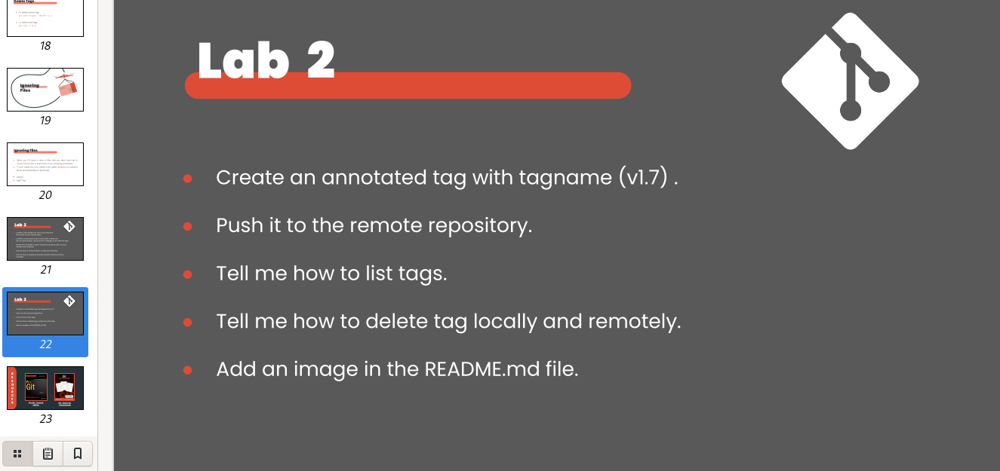

# Tell me how to remove them locally and remotely

## Remove Locally
```sh
git branch -d branch-name
```

## Remove Remotely
```sh
git push remoteName :branchName

# Tell me how to remove them locally and remotely


## Remove Remotely
```sh
git push remoteName :branchName

```

# Tell me how to checkout another branch without committing changes
```sh
git checkout test
git stash
git checkout main
```

# Tell me how to list tags
```sh
git tag

```

# Tell me how to delete tag locally and remotely.

```sh
git tag -d 'v1.7'

git push origins :v1.7
```


